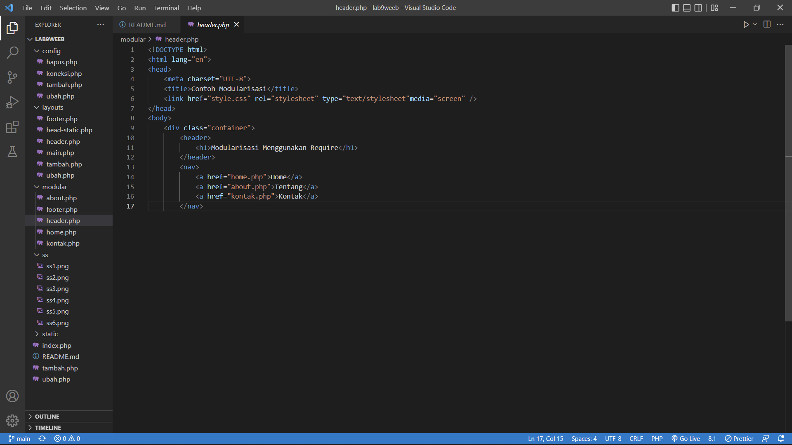
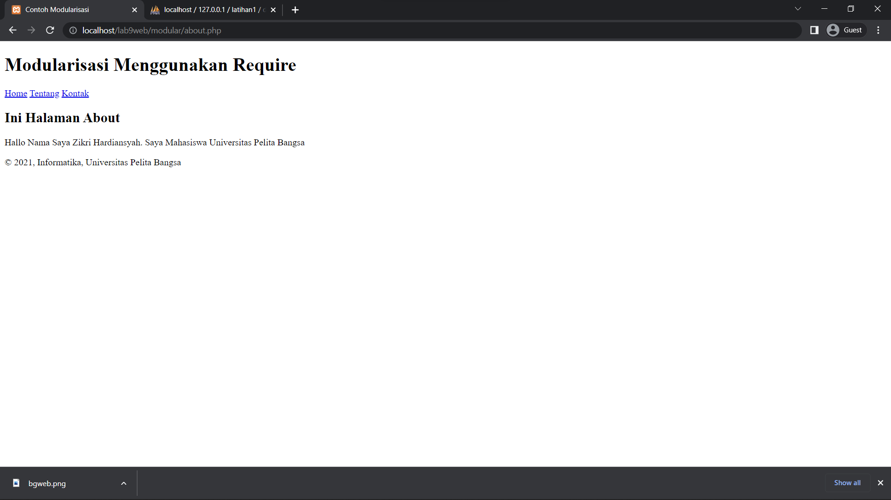
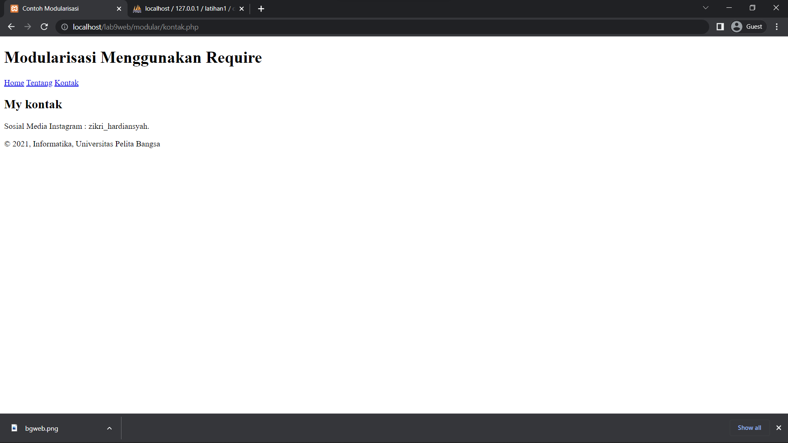
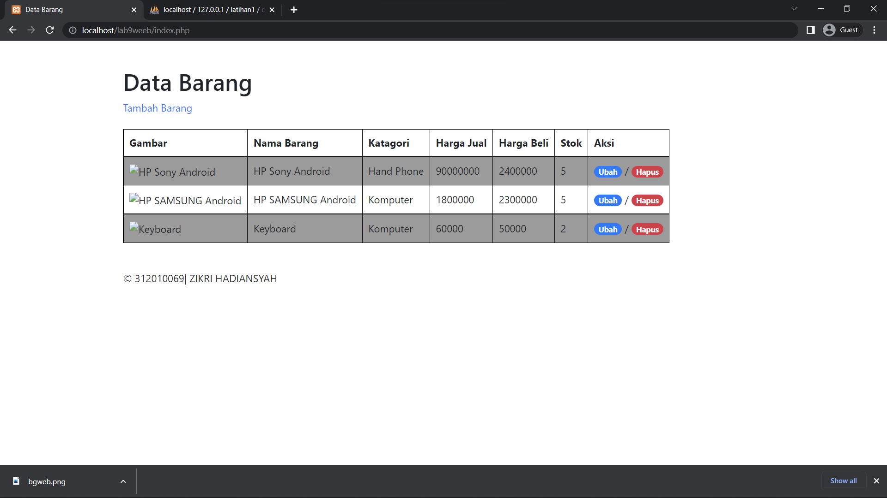
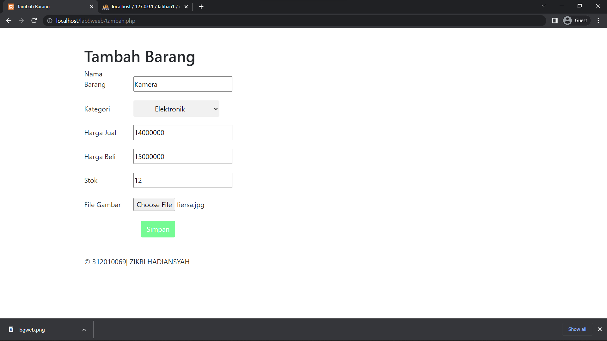
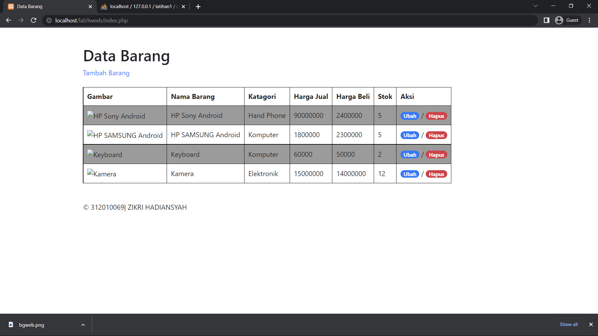

# Lab9Web

### Langak awal Buat file baru dengan nama header.php
- berikut lampiran codingan yang saya buat 

- Diwab ini hasil codingan yang telah saya buat, yaitu ada tampilan Home, about dan tentang

### Lalu Implementasikan konsep modularisasi pada kode program praktikum8 tentang database, sehingga setiap halamannya memiliki template tampilan yang sama.

- Berikut hasil yang sudah berubah dari sebulumnya, yang sebelumnya berantakan menjadi rapih dan tidak berubah setelah ganti layout disetiap box textnya

